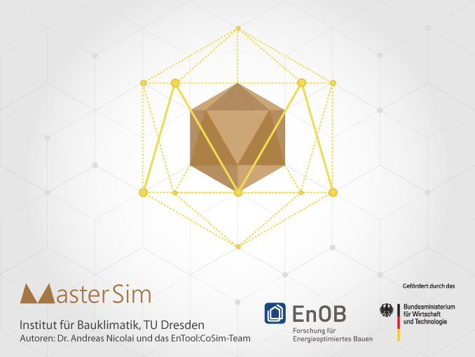
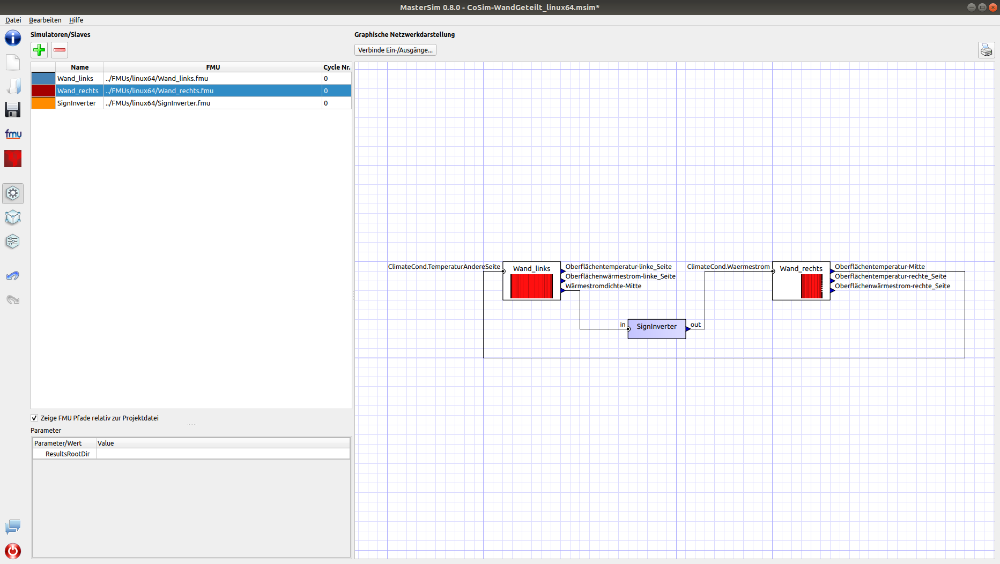
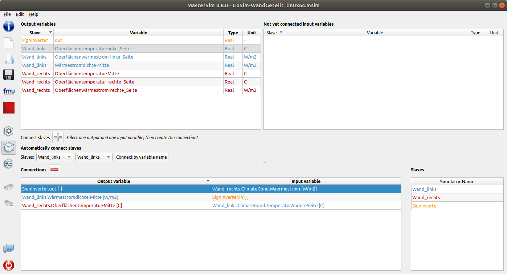
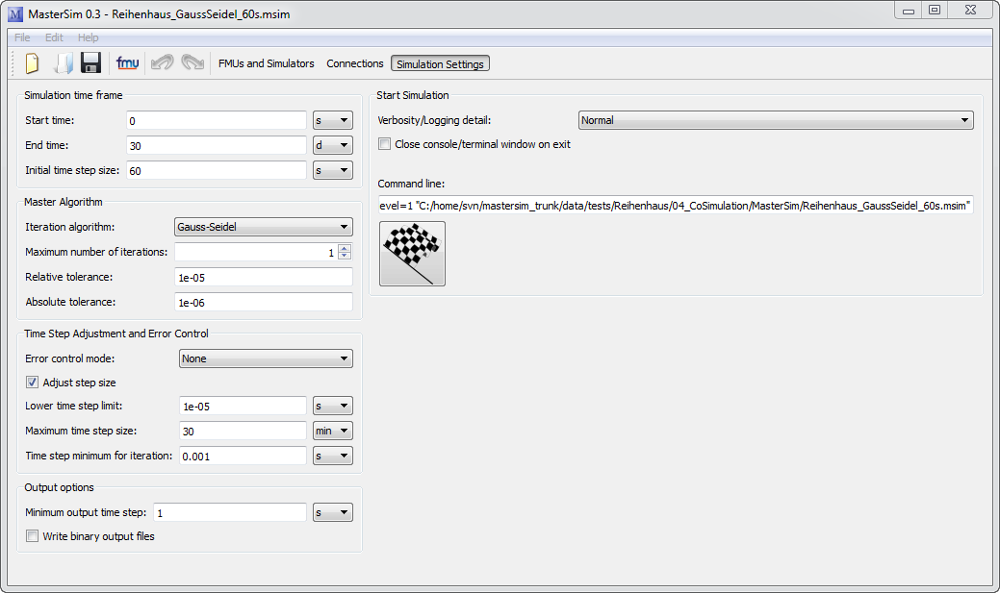
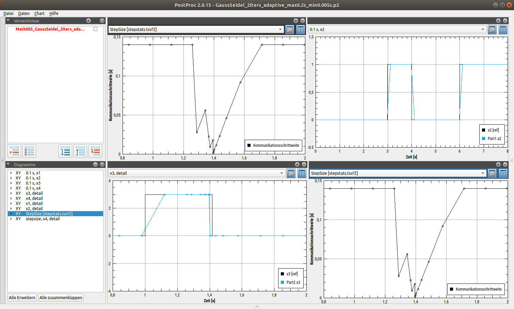
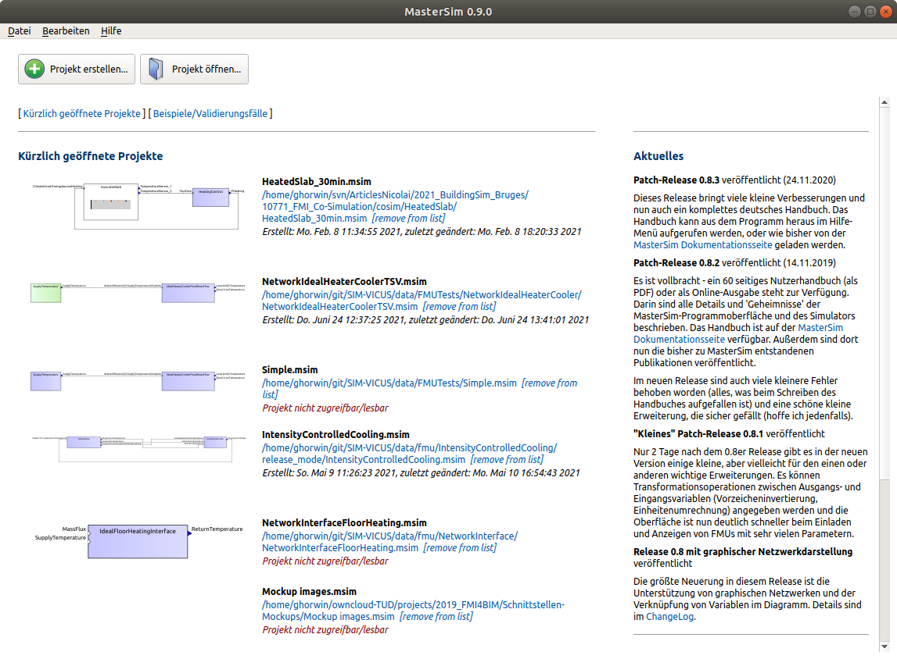

# About MasterSim ...

_MasterSim_ is an FMI Co-Simulation master and programming library. It supports the 
Functional Mock-Up Interface for Co-Simulation in Version 1.0 and 2.0. Using the functionality of 
version 2.0, it implements various iteration algorithms that rollback FMU slaves and increase stability of coupled simulations.



_MasterSim_ is actively maintained/developed by Andreas Nicolai (formerly at TU Dresden, Institut für Bauklimatik).

The main webpage of _MasterSim_ is https://bauklimatik-dresden.de/mastersim.

## Quality Assurance

We have continuous integration scripts running (build-test of all C/C++ code). For details, see [Jenkins](https://baukli01.arch.tu-dresden.de/jenkins).

| Test | Result|
|-----|-----|
| CI - Linux 64-bit (Ubuntu 20.04.3 LTS; Qt 5.12.9) | [](https://baukli01.arch.tu-dresden.de/jenkins/job/NR-Linux-MasterSim/)    |
| CI - Linux 64-bit (Ubuntu 20.04.3 LTS; Qt 5.12.9) | [](https://baukli01.arch.tu-dresden.de/jenkins/job/NR-Linux-MasterSim/)    |
| CI - Windows 64-bit (Win10, VC 2019, Qt 5.15.2) | [](https://baukli01.arch.tu-dresden.de/jenkins/job/NR64-Win-MasterSim/)   |
| CI - MacOS 64-bit (10.11 "El Capitan", Qt 5.11.3) | [](https://baukli01.arch.tu-dresden.de/jenkins/job/NR-IOS-MasterSim/) |

*Note:* the MacOS daily build service is currently offline. MacOS releases are built on demand.

## Quick Overview

The _MasterSim_ user interface allows importing of slaves and graphically routing input/output variables:



Connections can be reviewed and parametrized in the connection view:



The various numerical parameters (_MasterSim_ gives fine-grained control over what happens during the simulation):



Results can be easily analyzed with the free Post-Processing tool _PostProc 2_ (https://bauklimatik-dresden.de/postproc):



The welcome page of the software gives you a project overview and up-to-date development news.



## Download and Installation

### Linux

#### Debian/Ubuntu Packages

Ubuntu users can now simply install _MasterSim_ via private package repository [launchpad](https://launchpad.net/~ghorwin/+archive/ubuntu/sim):

```bash
# add repository
sudo add-apt-repository ppa:ghorwin/sim
sudo apt-get update
# install mastersim
sudo apt install mastersim
```

Available Ubuntu/Kubuntu/*buntu versions, see [launchpad](https://launchpad.net/~ghorwin/+archive/ubuntu/sim) or releases page.

If you require a deb package for a different release, just let me know by creating an issue.

#### Other distributions

Generally, for any (relatively) modern Linux distribution, there is a stand-alone software archive available for download:  see [releases](https://github.com/ghorwin/MasterSim/releases).

The following dependencies are required: Qt5 + Qt5-svg lib and zlib.

On Debian/Ubuntu systems, you can install these dependencies via packages:

```bash
# Ubuntu 18.04 
sudo apt install qt5-default libqt5svg5 zlib1g
```

### Windows x64

For Windows (7,8,10,11) an installation program is available: see [releases](https://github.com/ghorwin/MasterSim/releases).

Note that (unless there is a specific demand) I will not create x86 releases anylonger.

### On Mac

For MacOS 10.11 ("El Capitan") or newer, there is a dmg for download: see [releases](https://github.com/ghorwin/MasterSim/releases).


- [Download stats (github)...](https://tooomm.github.io/github-release-stats/?username=ghorwin&repository=mastersim)
- [Download stats (debian repository/launchpad)...](https://ppa-stats.sheth.io/#/?ppaName=sim&ppaOwner=ghorwin&packageName=mastersim)

